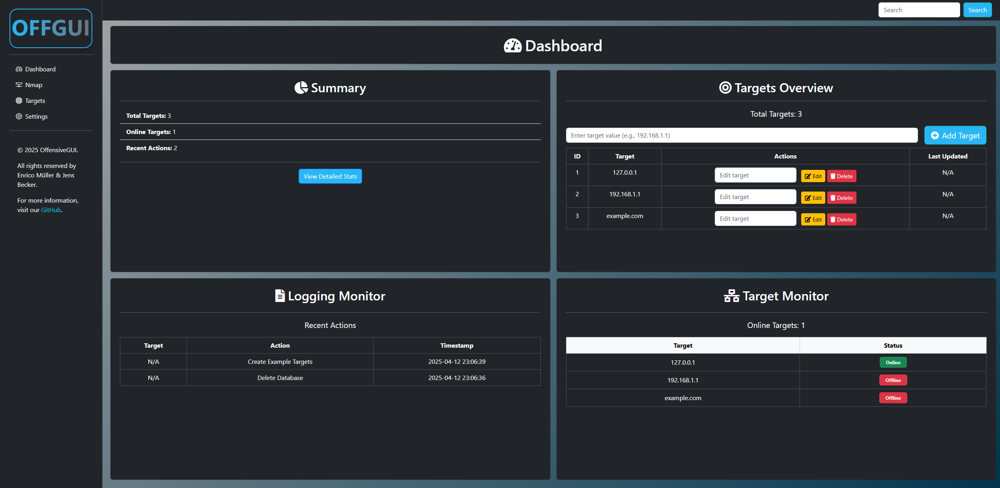
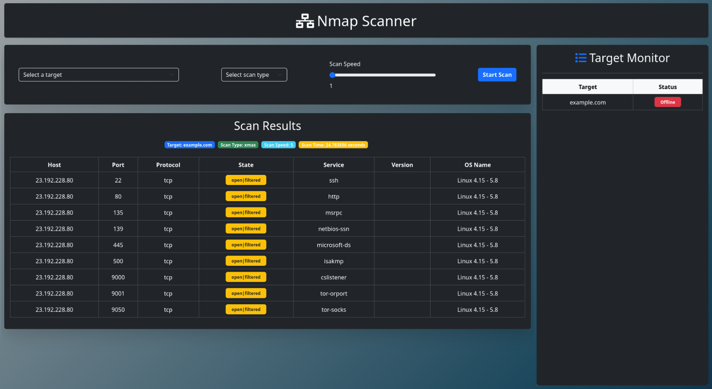
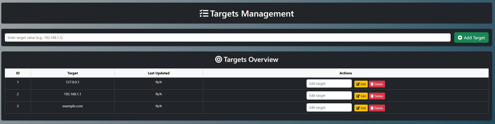
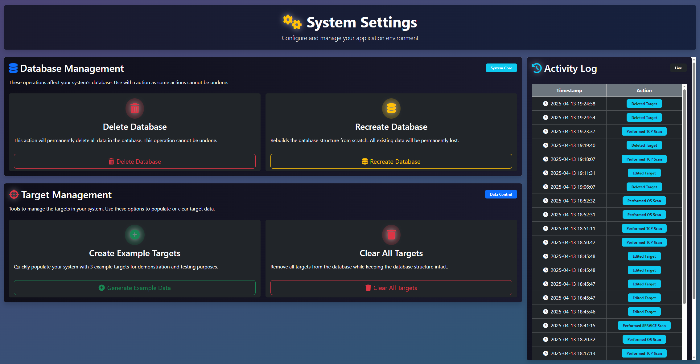

# OffensiveGUI


OffensiveGUI is an open-source tool tailored for network administrators and cybersecurity professionals. It simplifies network scanning, target monitoring, and database management through an intuitive web-based interface. Built on top of Nmap and other tools, it provides a seamless experience for managing network security tasks.

For advanced features like vulnerability scanning and asset discovery, explore [OffensiveGUI Pro Edition](https://github.com/jensbecker-dev/OffensiveGUI-Pro).

---

## 🚀 Features

- **Nmap Integration**: Perform TCP, UDP, XMAS, Service Version, and OS Fingerprinting scans.
- **Target Monitoring**: Real-time status updates for monitored targets.
- **Database Management**: Tools to clear or rebuild the database.
- **Comprehensive Logging**: Detailed logs for all actions and scans.
- **Web-Based Interface**: Built with Flask and Bootstrap for a responsive experience.

---

## 🛠️ Installation

### Prerequisites

- Python 3.8+
- [pip](https://pip.pypa.io/en/stable/)
- [Nmap](https://nmap.org/) (installed on your system)
- Dependencies listed in `requirements.txt`

### Steps

1. Clone the repository:
   ```bash
   git clone https://github.com/jensbecker-dev/OffensiveGUI.git
   cd OffensiveGUI
   ```

2. Set up a virtual environment:
   ```bash
   python -m venv venv
   source venv/bin/activate  # On Windows: venv\Scripts\activate
   ```

3. Install dependencies:
   ```bash
   pip install -r requirements.txt
   ```

4. Run the application:
   ```bash
   python app.py
   ```

   Or:
   ```bash
   flask run --port=8080
   ```

5. Access the application at `http://127.0.0.1:8080/`.

---

## 📖 Usage

### Target Management
- Add, edit, or delete targets by specifying IP addresses or domain names.

### Scanning
- Perform Nmap scans (TCP, UDP, XMAS, etc.) and CVE scans for vulnerabilities.
- Review scan history and results.

### Database Management
- Clear or rebuild the database as needed.

### Logging
- View and filter logs by date, target, or action type.

### Dashboard
- Monitor target statuses and recent actions in real-time.

---

## 📸 Screenshots

### Dashboard



### Nmap Scanner



### Target Management



### Settings



---

## 🤝 Contributing

Contributions are welcome! Follow these steps:

1. Fork the repository.
2. Create a new branch: `git checkout -b feature-name`.
3. Commit your changes: `git commit -m 'Add some feature'`.
4. Push to the branch: `git push origin feature-name`.
5. Open a pull request.

---

## 📜 License

This project is licensed under the MIT License. See the [LICENSE](LICENSE) file for details.
