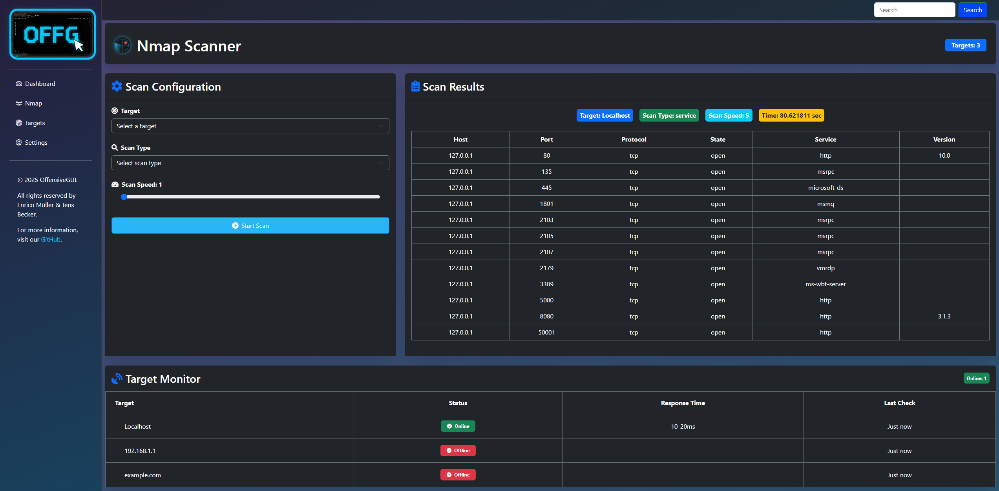
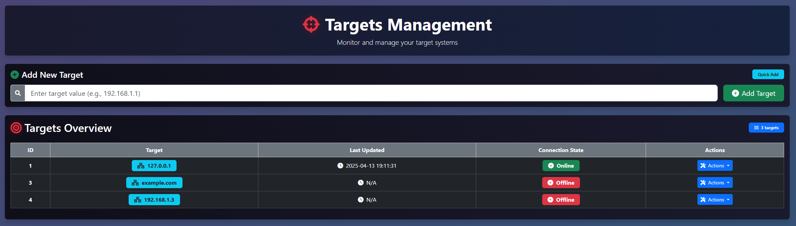

<br>
<div align="center">

   
   
   
   
   
   
   

</div>

---


Welcome to **OffensiveGUI** – your ultimate companion for network security management! 🚀

Designed for network administrators and cybersecurity professionals, OffensiveGUI simplifies tasks like network scanning, target monitoring, and database management. Built on top of powerful tools like Nmap, it offers an intuitive, web-based interface to streamline your workflow.

For advanced features such as vulnerability scanning and asset discovery, check out [OffensiveGUI Pro Edition](https://github.com/jensbecker-dev/OffensiveGUI-Pro).

---

## 🚀 Features

- **Nmap Integration**: Perform TCP, UDP, XMAS, Service Version, and OS Fingerprinting scans.
- **Target Monitoring**: Real-time status updates for monitored targets.
- **Database Management**: Tools to clear or rebuild the database.
- **Comprehensive Logging**: Detailed logs for all actions and scans.
- **Web-Based Interface**: Built with Flask and Bootstrap for a responsive experience.
- **CVE Vulnerability Scanning**: Identify vulnerabilities in scanned targets using the latest CVE database.
- **Custom Scan Profiles**: Save and reuse scan configurations for efficiency.
- **Role-Based Access Control (RBAC)**: Manage user permissions for enhanced security.
- **Dark Mode**: Toggle between light and dark themes for better usability.

---

## 🛠️ Installation

### Prerequisites

- Python 3.8+
- [pip](https://pip.pypa.io/en/stable/)
- [Nmap](https://nmap.org/) (installed on your system)
- Dependencies listed in `requirements.txt`

### Steps

1. Clone the repository:
   ```bash
   git clone https://github.com/jensbecker-dev/OffensiveGUI.git
   cd OffensiveGUI
   ```

2. Set up a virtual environment:
   ```bash
   python -m venv venv
   source venv/bin/activate  # On Windows: venv\Scripts\activate
   ```

3. Install dependencies:
   ```bash
   pip install -r requirements.txt
   ```

4. Run the application:
   ```bash
   python app.py
   ```

   Or:
   ```bash
   flask run --port=8080
   ```

5. Access the application at `http://127.0.0.1:8080/`.

---

## 📖 Usage

### Target Management
- Add, edit, or delete targets by specifying IP addresses or domain names.

### Scanning
### Scanning

OffensiveGUI supports the following Nmap scan types:

- **TCP Connect Scan (-sT)**: Establishes a full TCP connection to detect open ports.
- **SYN Scan (-sS)**: Performs a half-open scan, sending SYN packets to identify open ports without completing the handshake.
- **UDP Scan (-sU)**: Scans for open UDP ports by sending UDP packets to targets.
- **XMAS Scan (-sX)**: Sends packets with unusual flags to detect closed ports based on responses.
- **FIN Scan (-sF)**: Sends FIN packets to the target, attempting to bypass firewalls and detect open ports based on the lack of response.
- **NULL Scan (-sN)**: Sends packets with no flags set to identify closed ports based on responses.
- **ACK Scan (-sA)**: Maps firewall rules by analyzing responses to ACK packets.
- **Window Scan (-sW)**: Uses TCP window size to differentiate between open and closed ports.
- **Maimon Scan (-sM)**: Sends FIN/ACK packets to detect open ports on certain systems.
- **Service Version Detection (-sV)**: Identifies services and their versions running on open ports.
- **OS Fingerprinting (-O)**: Determines the operating system of the target based on network responses.
- **Aggressive Scan (-A)**: Combines OS detection, version detection, script scanning, and traceroute for detailed results.
- **Idle Scan (-sI)**: Uses a third-party host to perform a stealthy scan of the target.
- **Ping Scan (-sn)**: Discovers live hosts without performing a port scan.
- **Script Scan (--script)**: Executes Nmap scripts for vulnerability detection and additional information gathering.
- **Traceroute (--traceroute)**: Maps the network path to the target.

These scan types provide flexibility for various network analysis needs.

### Database Management
- Clear or rebuild the database as needed.

### Logging
- View and filter logs by date, target, or action type.

### Dashboard
- Monitor target statuses and recent actions in real-time.

### User Management
- Assign roles and permissions using the RBAC system.

### Theme Customization
- Switch between light and dark modes for a personalized experience.

---

## 📸 Screenshots

### Dashboard


### Nmap Scanner



### Target Management



### Settings


---

## 🤝 Contributing

Contributions are welcome! Follow these steps:

1. Fork the repository.
2. Create a new branch: `git checkout -b feature-name`.
3. Commit your changes: `git commit -m 'Add some feature'`.
4. Push to the branch: `git push origin feature-name`.
5. Open a pull request.

---

## 📜 License

This project is licensed under the MIT License. See the [LICENSE](LICENSE) file for details.
