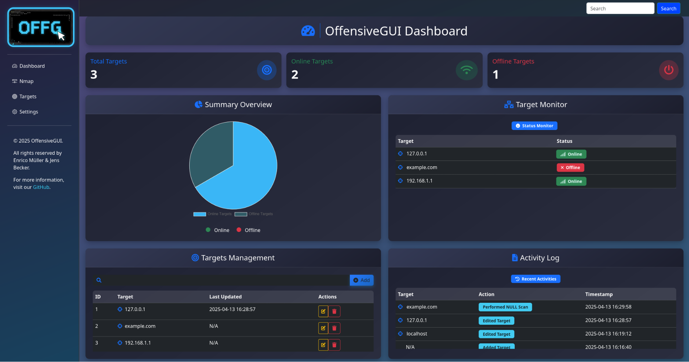
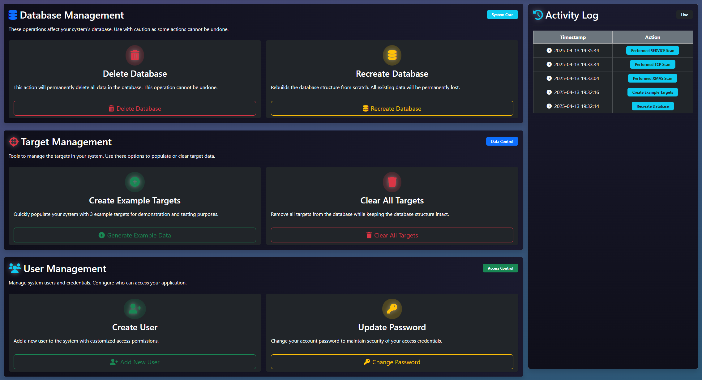

# OffensiveGUI Pro Edition


OffensiveGUI Pro Edition is an advanced version of [OffensiveGUI](https://github.com/jensbecker-dev/OffensiveGUI), specifically designed for bug bounty hunters. This edition provides additional features and tools tailored for scanning and identifying vulnerabilities in websites and assets of companies registered in the HackerOne Bug Bounty Program.

---

## 🚀 Features

- **Nmap Integration**: Support for various scan types such as TCP, UDP, XMAS, Service Version, and OS Fingerprinting.
- **CVE Scanner**: Integration of an advanced CVE scanner querying multiple databases like NVD, Exploit-DB, Vulners, MITRE, and Rapid7.
- **Target Monitoring**: Real-time monitoring of target statuses (Online, Offline, Unreachable).
- **Database Management**: Options to delete or recreate the database.
- **Logging**: Comprehensive logging of all actions and scans for better traceability.
- **Web-Based Interface**: Intuitive and responsive user interface built with Flask and Bootstrap.

---

## 🛠️ Installation

### Prerequisites

- Python 3.8 or higher
- [pip](https://pip.pypa.io/en/stable/)
- [Nmap](https://nmap.org/) (must be installed on your system)
- Dependencies listed in `requirements.txt`

### Steps

1. Clone the repository:
   ```bash
   git clone https://github.com/jensbecker-dev/OffensiveGUI-Pro.git
   cd OffensiveGUI-Pro
   ```

2. **Set Up a Virtual Environment:**
   ```bash
   python -m venv venv
   source venv/bin/activate  # On Windows: venv\Scripts\activate
   ```

3. **Install Dependencies:**
   ```bash
   pip install -r requirements.txt
   ```

4. **Run the Application:**
   ```bash
   python app.py
   ```

   **or**

   ```bash
   flask run --port=8080
   ```

5. **Access the Application:**

   Open your web browser and navigate to `http://127.0.0.1:8080/`.

---

## 📖 Usage

### Target Management
- **Add Targets**: Add new targets by specifying their IP address or domain name.
- **Edit Targets**: Modify existing target details.
- **Delete Targets**: Remove targets from the monitoring list.

### Scanning
- **Nmap Scans**: Perform various Nmap scans (TCP, UDP, XMAS, Service Version, OS Fingerprinting) on selected targets.
- **CVE Scans**: Scan targets for known vulnerabilities using multiple databases.
- **Scan History**: Review the history of performed scans and their results.

### Database Management
- **Clear Database**: Delete all data from the database.
- **Rebuild Database**: Recreate the database structure.

### Logging
- **View Logs**: Access detailed logs of all actions and scans.
- **Filter Logs**: Filter logs by date, target, or action type.

### Dashboard
- View an overview of targets, their statuses, and recent actions.
- Monitor the online/offline status of targets in real-time.

---

## 📸 Screenshots

### Dashboard



### Settings



## 🤝 Contributing

Contributions are welcome! Please follow these steps:

1. Fork the repository.
2. Create a new branch: `git checkout -b feature-name`.
3. Commit your changes: `git commit -m 'Add some feature'`.
4. Push to the branch: `git push origin feature-name`.
5. Open a pull request.

---

## 📜 License

This project is licensed under the MIT License. See the LICENSE file for details.


Similar code found with 1 license type